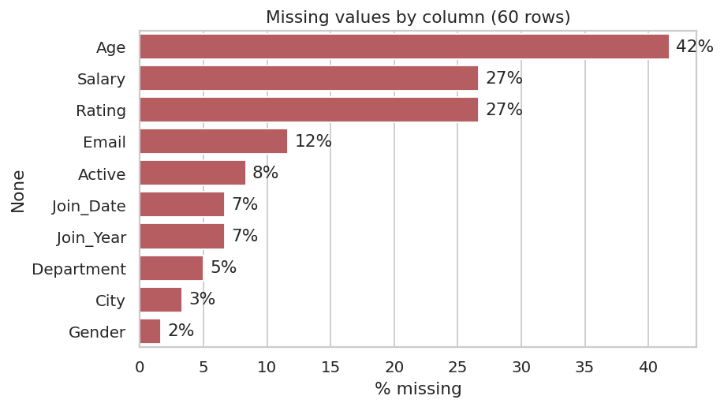
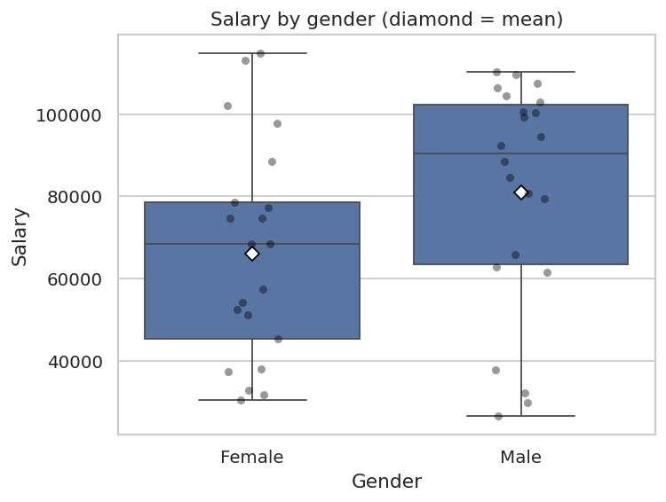
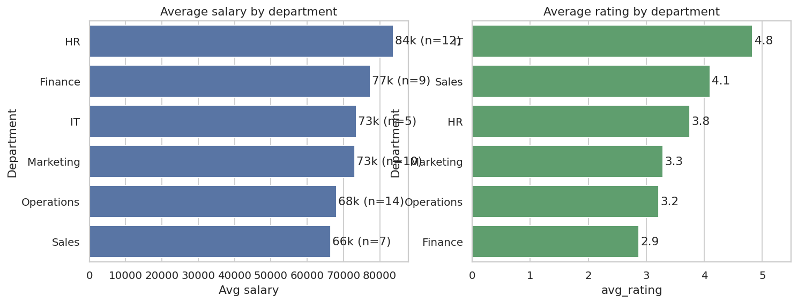
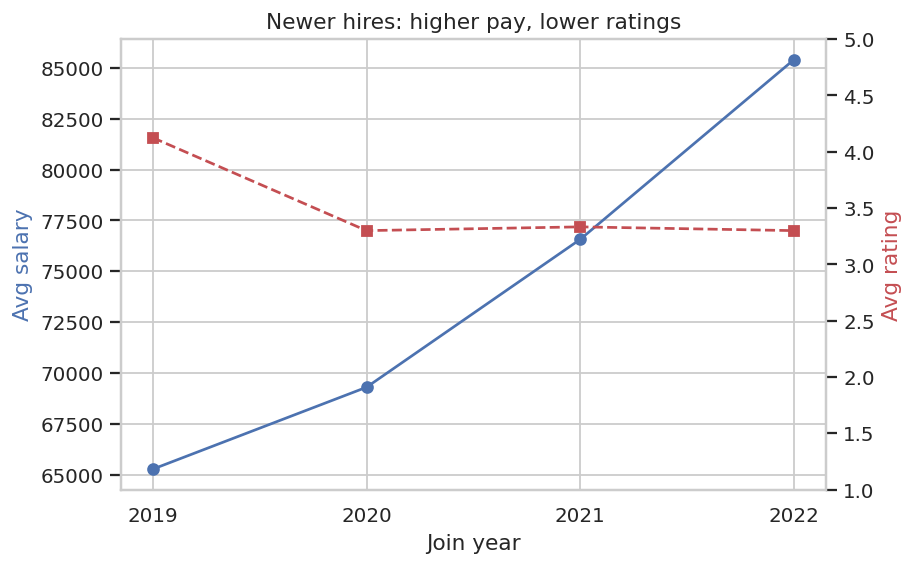
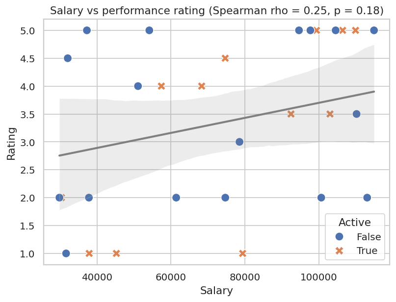
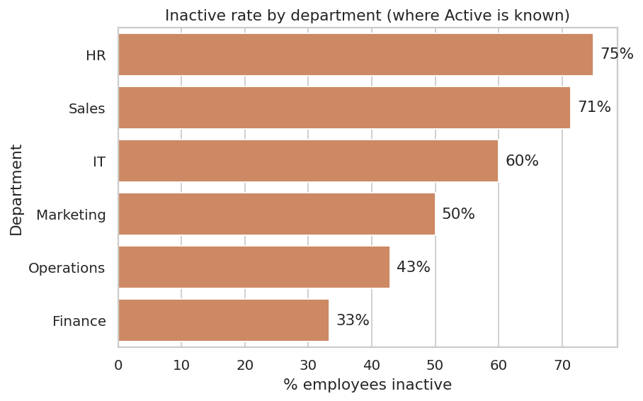
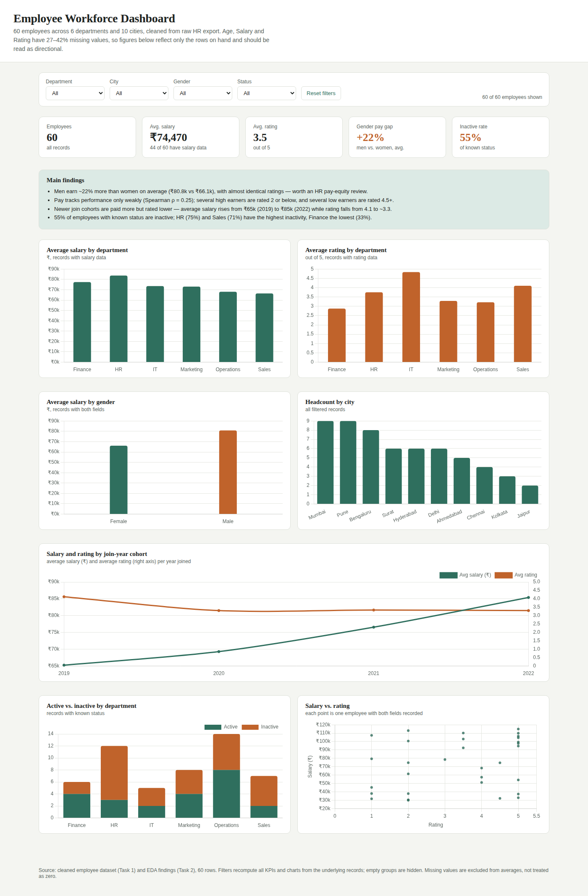
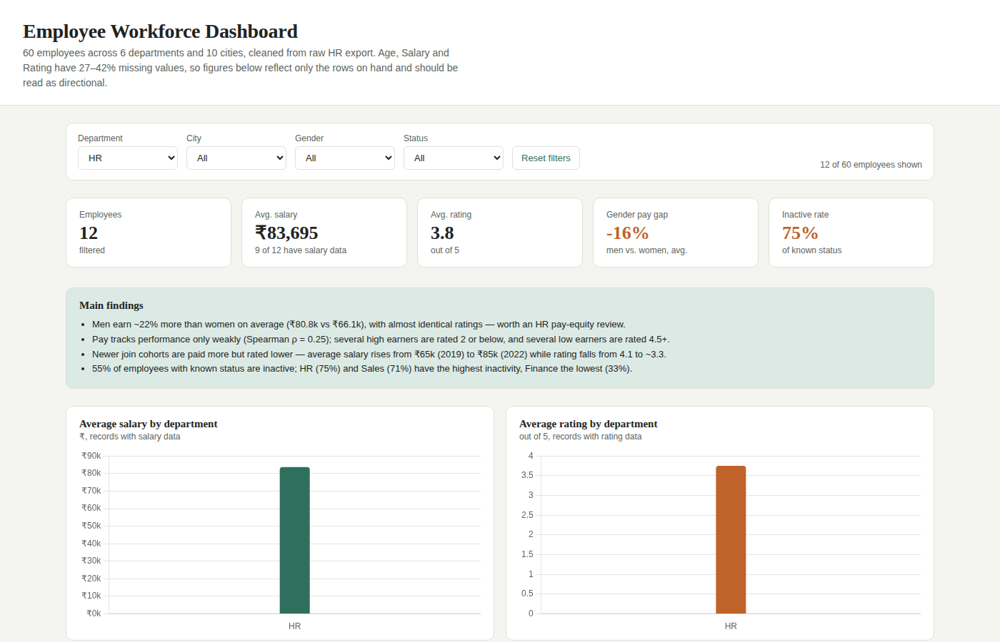

# Employee Workforce Analytics: End-to-End Case Study

**SWYNEX Technologies Data Analytics Internship, Task 4 (Final Project)**

A complete analytics case study on an HR dataset: messy raw data → cleaned dataset → exploratory analysis → interactive dashboard → business recommendations.

| Stage | Original repository |
|---|---|
| Task 1: Data Cleaning & Preparation | https://github.com/bhavani-rok31/SWYNEX-Data-Cleaning-Preparation |
| Task 2: Exploratory Data Analysis | https://github.com/bhavani-rok31/SWYNEX-Exploratory-Data-Analysis |
| Task 3: Interactive Dashboard | https://github.com/bhavani-rok31/SWYNEX-Interactive-Dashboard |

**Tools:** Excel · SQL (PostgreSQL syntax) · Python (pandas, NumPy, SciPy, Matplotlib, Seaborn) · Power BI (DAX) · HTML/Chart.js

---

## Table of Contents
1. [Problem Statement](#1-problem-statement)
2. [Dataset Information](#2-dataset-information)
3. [Data Cleaning Process](#3-data-cleaning-process)
4. [Analysis](#4-analysis)
5. [Dashboard](#5-dashboard)
6. [Key Business Insights & Recommendations](#6-key-business-insights--recommendations)
7. [Limitations](#7-limitations)
8. [Repository Structure & How to Reproduce](#8-repository-structure--how-to-reproduce)

---

## 1. Problem Statement

HR leadership needs a clear, trustworthy picture of the workforce, but the raw employee export is inconsistent and incomplete, so it cannot be used for decisions as it stands.

This project answers four business questions:

1. **Is pay fair?** Is there a pay gap between men and women, and does pay reflect performance?
2. **How is pay structured over time?** Are newer hires paid more than longer-serving staff, and are they performing better?
3. **Where are we losing people?** Which departments have the highest share of inactive employees, and who is leaving?
4. **Can we trust the data?** How complete and reliable is the HR data itself?

**Who cares:** HR leadership (pay equity, compensation design), department heads (retention), and the data team (data-capture quality).

---

## 2. Dataset Information

| Item | Detail |
|---|---|
| Source | Employee HR export (`messy_employee_data.csv`), provided for the internship task |
| Raw size | 69 rows × 11 columns |
| Cleaned size | **60 rows × 11 columns** |
| Join dates | 2019 – 2022 |
| Geography | 10 Indian cities (Mumbai, Pune, Bengaluru, Surat, Hyderabad, Delhi, Ahmedabad, Chennai, Kolkata, Jaipur) |

**Columns**

| Column | Type (cleaned) | Description |
|---|---|---|
| EmployeeID | text | Unique employee ID (E1001…) |
| Full Name | text | Employee name |
| Age | number | Age in years |
| Gender | category | Male / Female |
| Department | category | HR, Sales, Marketing, Operations, Finance, IT |
| City | category | Work location |
| Join_Date | date | Date of joining (YYYY-MM-DD) |
| Salary | number | Salary in ₹ |
| Email | text | Work/personal email |
| Rating | number | Performance rating, 1–5 |
| Active | boolean | Whether the employee is currently active |

Files: [`data/raw/raw_data.csv`](data/raw/raw_data.csv) (untouched original) and [`data/cleaned/cleaned_data.csv`](data/cleaned/cleaned_data.csv).

---

## 3. Data Cleaning Process

Done three ways (Excel, SQL, Python) to cross-check the result. The Python pipeline produces the final file and is reproducible: [`cleaning/clean_data.py`](cleaning/clean_data.py).

| Issue found | Examples | Fix applied |
|---|---|---|
| **Hidden missing values** | `"N/A"`, `"unknown"`, blanks | All converted to a single true missing value (not guessed) |
| **Duplicate records** | 1 fully identical row (`E1006`); repeated IDs with conflicting data (`E1023`: age 46 vs 55) | Exact duplicates dropped; for conflicting IDs the first occurrence was kept |
| **Wrong data types** | Age as `"twenty-five"`, `"51 yrs"`; Salary as `$`/`₹`/comma text; Rating as `"five"` | Text parsed to numbers, symbols and units stripped |
| **Mixed date formats** | 6+ different formats | Standardised to `YYYY-MM-DD` |
| **Inconsistent categories** | `MALE/Male/M/Man`; `hr/HR/Human Resources`; `Bangalore/Bengaluru`; `Yes/Y/1/TRUE` | Mapped to one standard value each; Active became a true boolean |
| **Impossible values** | Age `-58` or `>100`; Rating `10` on a 1–5 scale | Set to missing rather than invented |

**Result:** 69 → 60 rows, consistent types and categories. Remaining gaps are genuinely missing in the source and are reported honestly instead of imputed.

| Column | Missing after cleaning |
|---|---|
| Age | 25 (42%) |
| Salary | 16 (27%) |
| Rating | 16 (27%) |
| Email | 7 (12%) |
| Active | 5 (8%) |
| Join_Date | 4 (7%) |
| Department | 3 (5%) |
| City | 2 (3%) |
| Gender | 1 (2%) |

Only **13 of 60 rows are fully complete**, which shapes how strongly the findings below can be stated.

Supporting files: [`cleaning/clean_data.sql`](cleaning/clean_data.sql) · [`cleaning/excel_cleaning_steps.md`](cleaning/excel_cleaning_steps.md) · [`cleaning/employee_data_cleaning_1.ipynb`](cleaning/employee_data_cleaning_1.ipynb)

---

## 4. Analysis

Exploratory analysis in Python ([`analysis/eda.py`](analysis/eda.py), [`analysis/EDA_Task2.ipynb`](analysis/EDA_Task2.ipynb)): descriptive statistics, IQR outlier checks, group comparisons, a Welch t-test and Spearman correlation. All figures use available (non-missing) rows only.

| Metric | Age | Salary | Rating |
|---|---|---|---|
| Rows with data | 35 | 44 | 44 |
| Mean | 37.6 | ₹74,470 | 3.49 |
| Median | 36 | ₹77,939 | 3.5 |
| Std dev | 11.4 | ₹28,121 | 1.41 |
| Min – Max | 22 – 57 | ₹26,504 – ₹114,889 | 1 – 5 |

No statistical outliers were found in Age, Salary or Rating (IQR method). Full table: [`analysis/summary_stats.csv`](analysis/summary_stats.csv).

**Key charts**

| Missing data | Salary by gender |
|---|---|
|  |  |

| Department salary & rating | Join-year cohort trend |
|---|---|
|  |  |

| Salary vs rating | Inactivity by department |
|---|---|
|  |  |

All 10 charts are in [`images/charts/`](images/charts/).

---

## 5. Dashboard

An interactive workforce dashboard with 5 KPI cards, 7 charts and 4 filters (Department, City, Gender, Status). Every KPI and chart recalculates when a filter changes.



*Example: filtering to the HR department*



**What's included** (in [`dashboard/`](dashboard/)):

| File | Purpose |
|---|---|
| `reference_html_dashboard.html` | Working interactive dashboard; open in any browser (needs internet for Chart.js) |
| `employee_data.xlsx` | Cleaned data as an Excel Table, ready to load into Power BI |
| `DAX_measures.txt` | 10 DAX measures (Total Employees, Avg Salary, Gender Pay Gap %, Inactive Rate %, …) |
| `insights.txt` | Findings text used on the dashboard |

**Power BI report link:** _add your published link here, or place your `.pbix` file in `dashboard/`_

---

## 6. Key Business Insights & Recommendations

> All findings are **directional**: Age, Salary and Rating are 27–42% missing and group sizes are small.

**1. Men earn about 22% more than women, with no difference in performance.**
Average salary is ₹80.8k (men, n=22) vs ₹66.1k (women, n=21), while ratings are almost identical (3.46 vs 3.45). The gap is not statistically significant at the 5% level (Welch t-test p = 0.084), though the sample is small.
→ **Recommendation:** run a formal pay-equity audit, controlling for role, department and tenure.

**2. Pay is only weakly linked to performance.**
Salary and Rating have a Spearman correlation of 0.25 (p = 0.18, n = 31). Some employees earning above ₹90k are rated 2 or below, while some earning under ₹45k are rated 4.5 or above.
→ **Recommendation:** introduce performance-linked pay bands and review the highest-paid low performers and lowest-paid high performers.

**3. Newer hires are paid more but rated lower (pay compression).**
Average salary rises with each join-year cohort, from ₹65k (2019) to ₹85k (2022), while average rating falls from 4.1 to about 3.3.
→ **Recommendation:** review salaries of longer-serving staff to avoid retention risk, and tighten how starting salaries are set.

**4. More than half of employees with a known status are inactive, concentrated in HR and Sales.**
30 of 55 (55%) are inactive. The rate is 75% in HR and 71% in Sales, versus 33% in Finance. Inactive employees are younger on average (34.7 vs 40.5 years).
→ **Recommendation:** run exit/stay interviews in HR and Sales and look into early-career retention. First confirm what "Active = False" means in the source system.

**5. Data quality is itself a business risk.**
Only 13 of 60 records are complete. 40% of employees share a single join date (2021-05-14), which suggests a default or bulk-import value. Gender and name mismatches (e.g. "Aditya Verma" recorded as Female) also need verification.
→ **Recommendation:** make Age, Salary, Rating and Join_Date mandatory fields, validate entries at capture, and fix source data before any deeper modelling.

---

## 7. Limitations

- Small sample (60 employees); group-level results (n = 3–14) are indicative only.
- Missing values were left missing, not imputed, so each statistic uses a different subset of rows.
- Correlation is not causation. The pay-gap result is not statistically significant, and it does not control for role or seniority.
- The meaning of `Active` and the 2021-05-14 join date should be confirmed with the data owner.

---

## 8. Repository Structure & How to Reproduce

```
├── README.md
├── requirements.txt
├── data/
│   ├── raw/raw_data.csv
│   └── cleaned/cleaned_data.csv
├── cleaning/        clean_data.py · clean_data.sql · excel_cleaning_steps.md · notebook
├── analysis/        eda.py · EDA_Task2.ipynb · summary_stats.csv
├── dashboard/       HTML dashboard · employee_data.xlsx · DAX_measures.txt · insights.txt
└── images/          dashboard screenshots · charts/ (10 PNGs)
```

```bash
pip install -r requirements.txt
python cleaning/clean_data.py   # raw → cleaned_data.csv
python analysis/eda.py          # cleaned data → charts + summary_stats.csv
```

---

## About the Author

**Bhavani Rokkam** · Data Analytics Intern, SWYNEX Technologies

GitHub: [bhavani-rok31](https://github.com/bhavani-rok31) · LinkedIn: [Bhavani Rokkam](https://www.linkedin.com/in/bhavani-rokkam-893a25402/)